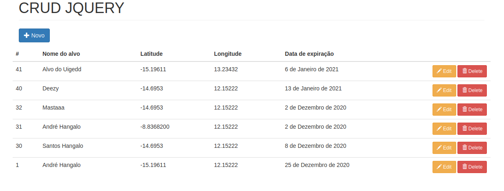

# crud_jquery

<h1>Requirements</h1>

<h3>Django</h3>
<h3>django-widget-tweaks</h3>

DJANGO JQUERY - BASIC CRUD APPLICATION
 
 <b>Basic CRUD applications use Django and Jquery</b>
 
 <h3>HOME PAGE - LIST</h3>

  

     

