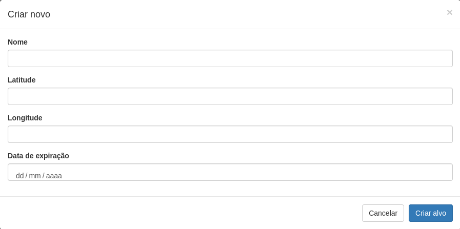
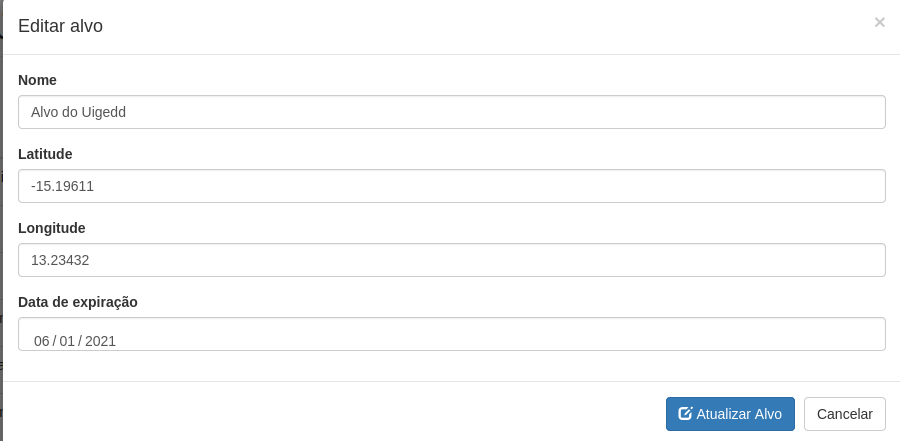
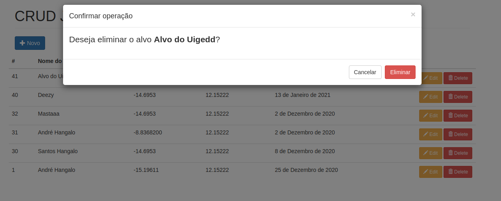

# DJANGO JQUERY - BASIC CRUD APPLICATION

<h1>Requirements</h1>

<h3>Django</h3>
<h3>django-widget-tweaks</h3>

 <h3>1. HOME PAGE - LIST</h3>

  

     

<h3>2. MODAL CREATE</h3>

  

     

<h3>3. MODAL UPDATE</h3>

  

     

<h3>4. MODAL DELETE</h3>

  

     

